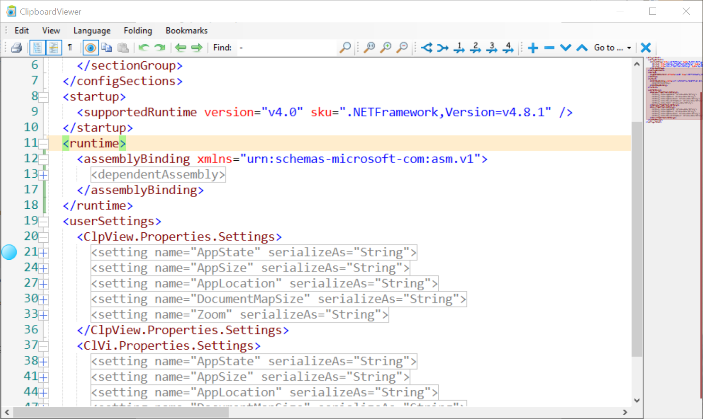

# Clipboard Viewer

Clipboard preview with code syntax highlighting.

- Display and monitoring of copied files.
- Support of bookmarks.
- Navigation between visited lines.
- Code folding based on layers.
- Temporary disabling of clipboard monitoring.
- Flexible display size.
- Document map.

  

Based on [FastColoredTextBox component](https://github.com/PavelTorgashov/FastColoredTextBox).